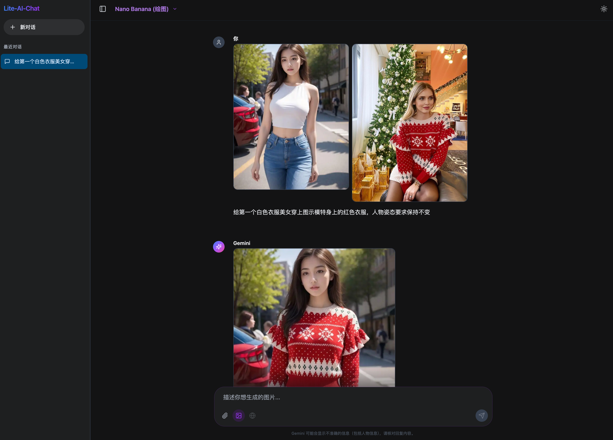

[**🇺🇸 English**](README.md) | [**🇨🇳 中文文档**](README_zh.md)
</div>

# Lite Ai Chat

**A powerful full-stack AI assistant seamlessly integrating Google's latest Gemini 3.0 Pro reasoning model and Nano Banana visual generation model.**

It is not just a chatbot, but an AI workbench integrating **complex reasoning, creative painting, visual understanding, and web search**. Ready to use out of the box with minimal configuration.

<br/>

---

## 📸 Screenshots

<div align="center">
  
  
  
</div>

---

## ✨ Highlights

### 🧠 Top-tier Reasoning (Gemini 3.0 Pro)
Built-in with Google's latest **Gemini 3.0 Pro** model, possessing industry-leading capabilities in logical reasoning, code writing, and complex problem-solving. Whether writing long articles, analyzing data, or generating code, the response is extremely fast and accurate.

### 🎨 Creative Painting & Image Editing (Image Generation)
Integrated **Gemini Image (Nano Banana)** model.
*   **Text-to-Image**: Enter "A cyberpunk cat surfing in space" to instantly generate high-definition images.
*   **Image-to-Image/Editing**: Upload a sketch or photo and tell the AI "turn it into an oil painting style" or "add a dog next to it" to achieve precise image modification and creation.

### 👀 Versatile Multimodal Vision
AI with "eyes". You can upload document screenshots, landscape photos, or complex charts. Gemini can accurately identify image details, extract text, and even explain data trends in charts for you.

### 🌐 Real-time Web Search (Google Search Grounding)
Say goodbye to outdated information. With **Web Search** enabled, the AI uses Google Search to retrieve the latest news, weather, stock prices, and sports scores in real-time, providing accurate answers with citation sources, greatly reducing "hallucinations".

### ⚡ Ultimate User Experience
*   **Streaming Response**: Output content in real-time like a typewriter, no long waiting.
*   **Perfect Markdown Rendering**: Code highlighting, tables, and mathematical formulas displayed perfectly.
*   **Local History**: Chat records are safely stored in the local browser for anytime review.
*   **Dark Mode**: Automatically follows the system or manual toggle, eye-friendly and beautiful.

---

## 🚀 Quick Start

### 1. Prerequisites
*   Ensure Node.js (v18+) is installed.
*   Create a configuration file `.env.local` in the project root directory:
    ```bash
    GEMINI_API_KEY=your_api_key_here
    ```

### 2. Development
Suitable for code modification and debugging. Frontend supports hot module replacement (HMR).

*   **Start**:
    ```bash
    sh run-dev.sh
    ```
    *Access address: http://localhost:3000*

### 3. Production
Suitable for formal deployment. Automatically builds the frontend and runs in the background, high-performance stable mode.

*   **Start**:
    ```bash
    sh run-prod.sh
    ```
    *   Initial run will install dependencies and build.
    *   Access address: http://localhost:3000

*   **Stop**:
    ```bash
    sh stop-prod.sh
    ```
*   **View Logs**:
    ```bash
    tail -f server.log
    ```

---

## 🛠️ Tech Stack
*   **Frontend**: React 19, Vite, TailwindCSS, Lucide Icons
*   **Backend**: Node.js, Express (API Proxy)
*   **AI SDK**: Google GenAI SDK (`@google/genai`)
*   **Storage**: IndexedDB (For high-performance storage of large images)

## 📂 Directory Structure
*   `src/` - Frontend React code
*   `server.js` - Backend API proxy & static file service
*   `dist/` - Built static resources (generated after running run-prod.sh)
*   `run-*.sh` - Shortcut running scripts